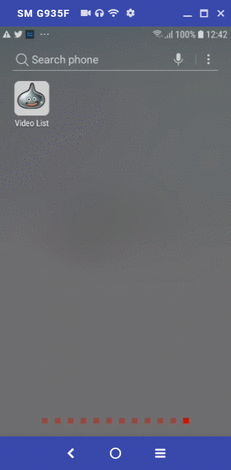
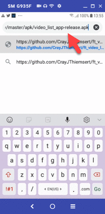

## Video List Assignment

Project of assignment for mobile developer skill test.

## Screenshots


##  Goal
The goal of this assignment is to verify that the applicant is able to:

* Create a new mobile App based on requirements. Show Video Search Results from this API
https://s3-ap-southeast-1.amazonaws.com/ysetter/media/video-search.json
* Can click to play video.
* Design the best code using MVC or decide on your own design pattern. If there is a more interesting design pattern.
* Do not use ready-made frameworks for development in order to Can consider the code design.
* Choose your own language.
* Take it to Github and submit the work as a Github URL.
* Place all code to run on the Docker and write the Start Docker method for trial use on README.md.
Of github.

## Tech/framework used
* Android/iOS Flutter (for programming language)
* BLOC (Business Logic Components) Pattern (for design pattern)
```sh
https://pub.dev/packages/flutter_bloc
```
* flutter_youtube_view (for playing youtube video)
```sh
https://pub.dev/packages/flutter_youtube_view
```

## API Reference
[API For video list: https://s3-ap-southeast-1.amazonaws.com/ysetter/media/video-search.json/](https://s3-ap-southeast-1.amazonaws.com/ysetter/media/video-search.json)


## How to view code?
1. Download code from <https://github.com/CrayJThiemsert/ft_video_list>.
2. Extract zip file from 1) to your machine.
3. Open Android Studio, choose menu "Import project (Gradle, Eclipse, ADT, etc.)". And select the directory that extract file from 2).
4. Wait for loading project files completed.

## How to play App?
1. On your Android mobile phone, open chrome browser and download APK file from <https://github.com/CrayJThiemsert/ft_video_list/raw/master/apk/video_list_app-release.apk>.
2. Install it by following the screenshots below.

## Screenshots


3. Run the "Video List" App after installation completed.
4. You can scroll the list and tap on the video that you want to play.

## Troubleshooting
1. If App show empty or blank screen. Please close App and run it again. The video list should show completly after rerun the App.

## Test user credential
Please register in Bitazza.com and use the credentials for testing.
